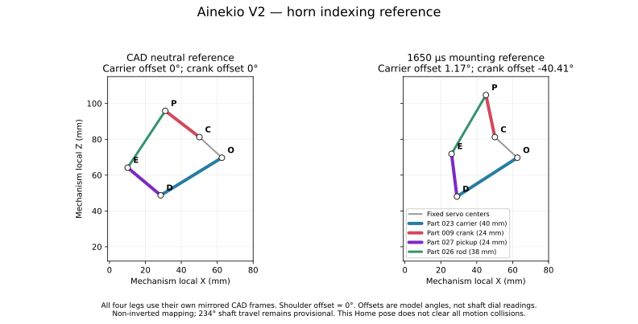

# V2 servo mounting and calibration

Profile: `v2-24-38-reference-1650`. This guide describes the current source; it does not flash or qualify hardware.

The owner reports assembling the legs at **1650 µs**, with the existing carrier/crank matchmarks aligned. The historical 300–2900 µs span and conversion, 2600/234 = 11.111111 µs/degree, remain provisional until actual shaft travel is measured. The arithmetic midpoint of that span is 1600 µs.

The matchmarks retain their existing model angles. Read [the remaining motion conflicts](mechanics/original-motion-range-audit.md); changing the pulse reference does not establish that the full library fits the installed travel.

## Mounting reference

Set the unloaded servo to the selected 1650 µs reference, then index its horn so the linkage matches the model offsets below. These offsets use the existing CAD neutral; they are not absolute shaft-angle readings. Shoulder offset 0° keeps Part 003 centered as drawn. Do not add another 90° in firmware.

| Joint type | Driven part | Pulse reference | Model offset | Combined recorded motion range |
| --- | --- | --- | --- | --- |
| Shoulder Part 002 | Part 003 | 1650 µs | 0° | -87.02…27.54°; shoulder conflict remains |
| Carrier Part 006 | Part 023 | 1650 µs | 1.17° | -89.13…135.37° |
| Crank Part 005 | Part 009 | 1650 µs | -40.41° | -128.11…101.29° |

At 1650 µs, the historical endpoints imply -121.5° to +112.5° relative to Home under the provisional non-inverted conversion. This is an arithmetic estimate, not measured coverage. All four legs use the same matchmark offsets in their respective CAD frames. Verify installed direction independently.

With this mapping, recorded carrier pulses span 646.65–3141.12 µs and crank pulses span 675.51–3224.50 µs. Compare these with measured endpoints before executing the complete library.

The combined Home lies inside the existing coupled envelope. Carrier/crank clearance still depends on both joint angles; use `servo_profile.json` and the range audit for the mechanical constraints. Changing the pulse reference does not resolve the flagged collisions elsewhere in the motions.

For a side-view jig in the mechanism local X/Z plane, the O→D carrier vector is -147.201° and C→P crank vector is 101.966°, measured from local +X toward +Z. These angles include the recorded CAD-neutral angles. Use these vectors and the actual part landmarks to make the alignment reference; spline tooth counts are not assumed.

| ID | Physical joint | CAD leg | Default channel | Model angle at Home |
| --- | --- | --- | --- | --- |
| 0 | rear left shoulder | FL | 0 | 0° |
| 1 | rear left carrier | FL | 1 | 1.17° |
| 2 | rear left crank | FL | 2 | -40.41° |
| 3 | rear right shoulder | FR | 3 | 0° |
| 4 | rear right carrier | FR | 4 | 1.17° |
| 5 | rear right crank | FR | 5 | -40.41° |
| 6 | front left shoulder | RL | 6 | 0° |
| 7 | front left carrier | RL | 7 | 1.17° |
| 8 | front left crank | RL | 8 | -40.41° |
| 9 | front right shoulder | RR | 9 | 0° |
| 10 | front right carrier | RR | 10 | 1.17° |
| 11 | front right crank | RR | 11 | -40.41° |

Channel numbers are proposed firmware defaults. The model records only front-left channels 6–8 as assigned; verify every connection. Retain confirmed channel assignments and inversion in the device settings. The CAD FL/FR labels identify the physical rear legs; CAD RL/RR identify the physical front legs.

## Assembly sequence

1. Support the chassis and leave the horn or linkage unloaded. Connect one identified servo at a time with power off.
2. In Calibration, establish pulse endpoints and use the selected 1650 µs mounting reference. Actual shaft rotation must be measured.
3. At 1650 µs, fit the horn to the corresponding model reference. Set the carrier and crank together to the table values when joining their rod; do not sweep either independently across its projected range.
4. Measure a small unloaded movement on either side of the reference to verify direction and calculate µs/degree. If inversion is required, recalculate the mounting reference before joining the linkage; changing Invert alone does not preserve these asymmetric travel windows. Measure additional points to detect nonlinearity.
5. If the nearest spline tooth does not align exactly, measure the actual model offset at the chosen reference pulse and enter that as Model angle at Home. Do not compensate by changing the geometric motion data.
6. Record the verified per-joint Home, channel, direction, model offset and scale. Stage and Save deliberately. Then establish a known reference with Calibration Home/Move before requesting semantic motion.
7. Check small supported motions before testing full trajectories under load. Current tests do not establish cable clearance, shoulder/body collisions, torque, tracking, traction or balance.

## Existing calibration and commands

The firmware stores Home, channel, inversion, model angle and scale in `p4_config/joint_mapping`, exposed through `body_calibration_v2`. There are no pulse endpoint fields or old-format importer. Existing saved mappings are retained: updating firmware defaults does not physically re-index horns or overwrite calibration. When adopting these mounting positions, update the measured Home angles and explicitly Stage and Save the mapping. Save disables outputs and does not move a servo. Missing saved mapping leaves automatic startup Home off; explicit calibration is available.

Home is the mounting reference. CAD Neutral is zero model offsets. Stand, Sit and Rest are distinct geometric poses. A commanded pulse is not measured shaft feedback. After outputs are disabled, motion requires an explicit known reference. The reported endpoints remain reference data; they are not motion caps or editable fields in this contract. Automatic pulses are checked against PWM timer capacity. The restored motion library has unresolved electrical and modeled collision conflicts; see the range audit before assembly.

Entry paths coordinate carrier and crank, with exact electrical-extrema preflight and a 1000 µs/s pulse-rate bound. Their internal-leg clearance check does not prove floor clearance or loaded stability during arbitrary pose changes.

The finite library retains its authored gestures. Walk has 92 mm planted sweep and 30 mm rear bias; Crawl has 18 mm sweep, 4 mm rear bias and -35 mm body translation. Continuous gaits share a joint-speed-limited clock; the requested cadence may take longer. See mechanics/original-motion-range-audit.json for recorded range conflicts.

See [the machine-readable mounting table](mechanics/servo-mounting-reference.csv) and [the canonical coupled profile](servo_profile.json).
