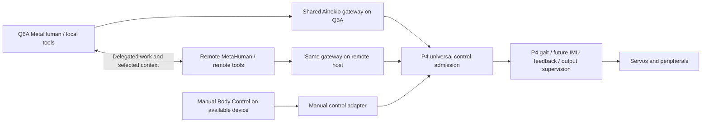

# Distributed Robot Foundation

Updated: 2026-09-28 — universal P4 control, interchangeable hosts and shared coordination

Status: design draft for the next system release. Automatic takeover and the
cross-installation coordination contract are not implemented. Confirmed owner
requirements and proposed mechanisms are distinguished below.

This extends [Body Control Integration](BODY_CONTROL_INTEGRATION.md). The
[resource budget](v2-12servo/RESOURCE_BUDGET.md) owns hardware limits/arithmetic.
The design does not amend the normative Ainekio specification or supersede
[MetaHuman runtime ownership rules](https://github.com/Greg-Aster/metahuman-os/blob/main/docs/technical/MAINTAINED_SURFACE.md).

## 1. Confirmed requirements

| Owner requirement | Consequence |
| --- | --- |
| P4 is the robot brain; controls are independent of their source | P4 retains physical execution/admission; hosts supply interchangeable control and compute |
| Wireless first, Q6A offboard to reduce robot weight and carried power | Reuse wireless transport; native USB remains an alternative |
| Q6A and remote both run MetaHuman OS | Allocate the suite across installations; remote is more than an LLM endpoint |
| Q6A handles STT, TTS, image/audio processing and lightweight routing | Prefer nearby responsive processing and send selected data upstream |
| Remote handles heavy reasoning, memory, training and expensive functions; may be offshore | Keep WAN responses outside P4's local motion/feedback loop |
| No Q6A → remote can take over; no remote → Q6A owns | Neither host can be a mandatory intermediary for the other |
| Neither available → manual Body Control remains possible | A surviving independent manual client/server path is required |
| Manual device remains undecided: laptop, desktop without MetaHuman, future phone app, etc. | Define the interface independently of deployment device; do not assume an on-P4 web dashboard was selected |
| Continue defined local skills during remote outage; pause remote-dependent tasks | Advertise capabilities/dependencies for each operating mode |
| One universal connection system and a solid foundation before coding | Extend existing owners with shared contracts rather than separate control stacks |

The owner's proposed shared Robot Status, routing and queue system is addressed
in section 5. ROS is an option for specific components, not yet a selected
replacement. The earlier proposal making Q6A mandatory for body control is
withdrawn because it cannot satisfy Q6A-absent operation.

## 2. What already exists

**Body Control is already a common host-side command path. Automatic host/source
takeover is not implemented.**

| Inspected owner | Existing behavior | Gap for this design |
| --- | --- | --- |
| [Gateway entrypoint](../Master/gateway/server/__main__.py) | One GatewayService is passed to manual dashboard and MetaHuman Environment adapter | General provider registration and source ownership policy |
| [Dashboard](../Master/gateway/dashboard/server.py) | Manual intents and stop call the same gateway service; MetaHuman is not required | Still needs its gateway host and body link |
| [Environment adapter](../Master/gateway/environment_adapter/server.py) | One active bridge socket; a new authenticated bridge replaces the previous one | Socket replacement is not priority-based takeover |
| Gateway `/environment` route | Loopback-only; relay requests rejected | Keep bridge/gateway co-located per host or explicitly revise this boundary |
| [P4 controller](../Slave/firmware/esp32p4-wifi6/main/controller.c) | One outbound WebSocket to configured `endpoint_url`; retries only that host | No alternate-host selection or automatic Q6A/remote failover |
| [Shared admission](../Slave/software/core/src/admission.c) | Connection generation, epoch, sequence, expiry and command validation | Robot-wide controller grant/priority across independent hosts |
| [Host action receipts](../Master/gateway/environment_adapter/action_receipts.py) | Durable MetaHuman action identity and Coordinator body-lease fencing in host SQLite | Two independent host databases do not establish global control ownership; manual dashboard uses a different admission entry |
| [P4 portal](../Slave/firmware/esp32p4-wifi6/main/portal.c) | Setup page and `/configure` | No on-P4 manual Body Control API/UI |
| MetaHuman `robot-status.ts` | Profile-scoped situation/body/task projection, source timestamps and eight history entries; task read from durable execution | Not a replicated multi-host health/control/work service |
| MetaHuman `queue/queue-system.ts` | Existing Work Coordinator, work/resource lanes and remote dispatcher | Cross-installation delegation/takeover must extend these owners |

**Discovery correction:** the gateway advertises DNS-SD, but the inspected P4
link task uses its configured URL directly. Gateway discovery documentation and
another firmware target's behavior do not prove P4 discovery or failover.

## 3. Universal control architecture

Arrows are candidate command paths, not simultaneous motion writers. The socket
direction can remain P4-initiated as today. Universal means one command/capability
contract and one authoritative admission policy, not one irreplaceable server.

**Proposed implementation:** extend shared admission and P4 connection ownership
so P4 grants the right to control the body. Reuse the same Ainekio gateway code on
any host that needs it. Every motion source, including manual, MetaHuman and ROS,
must converge on these rules. Preserve authentication and source permissions.

| Control responsibility | Proposed rule |
| --- | --- |
| Provider registration/readiness | Bounded configured candidates; distinguish network, gateway and application health |
| Motion ownership | One P4-authorized grant with authenticated source, body boot/session identity, generation and expiry |
| Command admission | Validate current grant, command identity, supported capability and deadline on P4 |
| Takeover | Revoke old grant; apply configured priority/readiness; report new source and reason |
| Manual override | Proposed explicit manual takeover above autonomous motion; specify stop and re-arm behavior before implementation |
| Late/replayed commands | Reject obsolete grant/session and expired actions, including after reconnect/reboot |
| Returning provider | Rejoin as candidate; do not seize an active manual session or replay old objectives |
| Interrupted work | Reconcile body state and receipts; source takeover does not automatically resume a high-level graph |

Independent host lease counters cannot be compared as a robot-wide ordering.
The new grant must distinguish body boots and host sessions; its representation,
authentication and renewal need protocol design within the existing admission
owner. This is not a proposal for another independent controller manager.

For host failover, a bounded ordered endpoint list with one active P4 WebSocket
is the smallest extension of today's transport. Direct phone/browser access, if
later selected, must feed the same admission owner. Its hosting and transport
remain open; no separate motion implementation is needed.

**Network requirement:** use an independent router/AP for the first deployment.
P4 must retain a route to the remote gateway when Q6A fails. If Q6A is its only
hotspot or Internet route, remote takeover is unavailable after Q6A failure.
Likewise, a remote relay whose origin is Q6A is not an independent fallback.

## 4. Functions and operating modes

| Function | Preferred owner/location | Degraded operation |
| --- | --- | --- |
| Gait, calibration, actuator limits, output supervision | P4 existing body/controller/PCA owners | Remains local in every mode |
| IMU acquisition, attitude estimation and correction | P4 existing motion owner, to be implemented | No balance capability until integrated and physically qualified |
| Camera encoding, mic, playback, wake/VAD, display hardware | P4 media/display owners | Consumers may change; physical I/O remains on P4 |
| Control-source grant and host selection | Extend P4/shared admission and connection owner | Reject stale/displaced sources even if hosts disagree |
| Protocol translation, manual dashboard and media delivery | Same Ainekio gateway implementation on available host | Independent manual deployment when other hosts are absent |
| STT/TTS and image/audio processing | Q6A MetaHuman voice owners and selected perception runtime | Remote supplies only explicitly installed/qualified equivalents, with separate WAN budget |
| Lightweight routing and local skills | Q6A model router, Agent Catalog and graphs | Remote-only/manual modes advertise their actual available capabilities |
| Heavy reasoning, expensive tools, training | Remote MetaHuman provider/Coordinator/training owners | Pause remote-dependent work; Q6A local skills continue |
| Long-term memory, retrieval, consolidation and persona evolution | Proposed remote MetaHuman memory/storage/Agency/persona owners | Bounded local cache, working context and pending events |
| Active high-level robot execution | Existing Coordinator/durable graph owner in the currently controlling MetaHuman instance | Reconcile before explicit handoff; no independent continuation by both hosts |
| Autonomy admission | Existing Robot Operator in current controlling provider | Other installations can compute but cannot produce effects for the leased body |
| Organizer, curator, reflection, curiosity/research, daydreaming, psychoanalysis, mood | Remote by default through existing catalog/work owners | Inventory each workflow's dependencies before migration |
| Status and diagnostics | Shared typed facts consumed by existing status/UI owners | Consumers show freshness and current authority, not guessed availability |
| ROS tooling | Optional adapter/consumers on available host | P4/manual control does not require ROS to be running |

When both hosts are available, propose Q6A for live interaction and remote for
heavy jobs. User preference and precise return policy still need definition.
Remote takeover means control availability, not a promise of identical speech,
vision performance or automatic recovery of every interrupted MetaHuman task.
Use one MetaHuman codebase with role configuration, initially at the same tested
release. Existing local/server deployment modes alone do not implement this split.

## 5. Shared status, routing and queues

**Recommendation: evolve Robot Status into the common view of a distributed
coordination contract, reusing existing owners for routing and execution.**
Present one system to clients while keeping responsibilities explicit underneath.

The current MetaHuman snapshot already separates body facts, task projection and
semantic situation. Keep those useful fields. Extend deterministic health,
capability and ownership data; do not require an LLM-generated status summary to
detect a disconnected controller or allow an emergency stop.

| Responsibility | Reuse / extension | Authority |
| --- | --- | --- |
| Shared status/read model | Existing Robot Status, gateway/body telemetry and service diagnostics | Projects authoritative facts; never creates or resumes an objective |
| Body-source selection | Existing P4 admission/connection owner, extended | P4 grants/revokes physical control |
| Work/provider routing | Existing MetaHuman work submission/Coordinator; model router/resolver for model selection | Select providers by capability, readiness, locality, resource capacity and deadline |
| Finite-job queues | Existing Work Coordinator on each installation | One owner per admitted job; explicit parent/remote-child correlation |
| Speech delivery | Existing voice/robot speech/delivery owners | Preserve phrase ordering, cancellation and delivery identity |
| Body command queues | Existing gateway and P4 queues | Enforce current grant, expiry, bounded capacity and result correlation |
| Media buffers | Existing camera/audio owners | Byte/age limits; discard expendable old previews instead of delaying control |
| ROS diagnostics | Adapter into/out of shared health facts | Standard health reporting and visualization, not work admission or election |

The universal body-control contract must remain usable by a standalone manual
client without MetaHuman's Coordinator. MetaHuman job orchestration is layered
above it. Reusing its Coordinator does not make MetaHuman a dependency of P4 or
manual Body Control.

Do not put emergency stop, camera frames, speech, walking intentions and training
jobs into one FIFO. They have different deadlines, ordering and retry rules.
The common interface can submit/query/cancel work and subscribe to state while
existing owners enforce the relevant queues and resource limits.

### Shared state contract

| Facts | Authoritative writer | Required metadata |
| --- | --- | --- |
| Robot mode, current control source, grant, actuator/fault state and sensed telemetry | P4 | Robot identity, boot/session, monotonic sequence, source time, validity |
| Host/service capability and resource availability | The reporting host/service | Provider identity/boot, revision, health, observed time, freshness limit |
| Job/action lifecycle | Admitting execution owner; P4/gateway supplies physical receipts | Job/action and parent IDs, owner, revision, control grant and outcome evidence |
| Memory/persona revision | Selected MetaHuman memory/persona owner | Logical identity, revision and provenance |
| Situation summary | Current MetaHuman interpretation | Observation references, age and uncertainties; cannot overwrite measured facts |

Publish typed updates and provide a bounded snapshot for reconnect/resynchronizing.
Each consumer maintains a read view; all three machines must not edit the same
JSON file or claim to own the same fact. Sequence gaps trigger resynchronization;
old-source/old-boot updates are rejected. Explicitly mark stale/unknown sources
and retain their last observed value as historical, not current fact.

During a network partition, views can disagree temporarily. The system cannot
promise instantaneous identical state across disconnected machines. P4's local
grant remains authoritative for physical effects; remote job/memory authorities
remain explicit. Status delivery must not depend solely on whichever Q6A process
is being monitored.

### ROS comparison for status and coordination

| ROS facility | Useful replacement/reuse scope | Does not supply |
| --- | --- | --- |
| `diagnostic_msgs`, `diagnostic_updater` | Standard component health and measurements, including OK/WARN/ERROR/STALE, publishing-rate checks | Robot goals, memory, work routing or control election |
| `diagnostic_aggregator` and `rqt_robot_monitor` | Grouped health summaries and monitoring UI | A replicated authoritative robot-state database or durable job queue |
| Lifecycle nodes | Configure/activate/deactivate/cleanup ROS components | Supervision of all existing non-ROS processes or automatic host takeover |
| Topics, services, actions and QoS | Transport, request/response, goal feedback/cancellation, history and freshness policies | The application's capability routing, durable retries or cross-host ownership policy |
| `twist_mux` | Priorities/locks/timeouts for velocity inputs | General semantic actions, memory/jobs or survival of its host failure |
| `ros2_control` Controller Manager | Controller/hardware lifecycle and controller-error fallback | Choosing between Q6A, remote and manual after the manager's host disappears |

**Decision proposal:** adapt existing Robot Status and Coordinator owners; use ROS
diagnostics for the health/tooling part if ROS is adopted. Do not replace the
complete MetaHuman status/task model with diagnostics or build a new standalone
scheduler. New work belongs in the missing cross-host contracts, P4 source
arbitration and adapters. A new broker is not selected; ROS/DDS versus existing
application transport must be evaluated against these contracts, including
remote hosting and manual clients, before adding infrastructure.

Official references, checked 2026-09-28:
[DiagnosticStatus](https://github.com/ros2/common_interfaces/blob/jazzy/diagnostic_msgs/msg/DiagnosticStatus.msg),
[diagnostic_updater](https://github.com/ros/diagnostics/blob/ros2-jazzy/diagnostic_updater/README.md),
[diagnostic_aggregator and monitor](https://github.com/ros/diagnostics/blob/ros2-jazzy/diagnostic_aggregator/README.md),
[lifecycle design](https://design.ros2.org/articles/node_lifecycle.html),
[ROS QoS](https://github.com/ros2/ros2_documentation/blob/jazzy/source/Concepts/Intermediate/About-Quality-of-Service-Settings.rst),
[ROS actions](https://github.com/ros2/ros2_documentation/blob/jazzy/source/Concepts/Basic/About-Actions.rst),
[twist_mux](https://index.ros.org/p/twist_mux/),
[Controller Manager](https://control.ros.org/jazzy/doc/ros2_control/controller_manager/doc/userdoc.html).

## 6. Further contracts before feature migration

Define command/capability schemas and compatibility; grant authentication and
renewal; provider readiness and resource claims; job/action correlation and
cancellation; execution handoff; memory deduplication/conflicts/deletion; observation
freshness; and storage/queue limits. Reuse existing public API, catalog, storage,
work and lifecycle owners. Keep graph execution and body-control ownership
separate: changing the controlling source need not move an entire graph database.

Proposed first local skills: stop/cancel, status, speech input/output, image capture
and individually qualified finite body actions. Each gets numeric response and
resource targets before coding. Dynamic walking/fall recovery is a separate
physical capability gate.

Remote delegation needs an immutable request ID, parent execution/revision,
authenticated scope, deadline and bounded context. Duplicate/late results must
not create duplicate effects. Unknown physical outcomes require reconciliation,
not blind replay. Use monotonic local deadlines; define cross-host expiry without
assuming independent monotonic clocks share an origin.

Proposed memory policy: remote long-term authority with bounded Q6A working/cache
state and pending uploads. Existing profile bundle export/import is not proof of
continuous conflict-safe replication. Send transcripts, selected images and
compact facts upstream by default. Raw media needs a declared consumer/budget.
P4 camera data still consumes the body Wi-Fi link even when Q6A reduces WAN data.

## 7. Failure and resource acceptance

| Scenario | Required result |
| --- | --- |
| Remote absent, Q6A/body healthy | Local skills continue; remote work pauses; bounded pending uploads |
| MetaHuman process fails but gateway remains | Distinguish provider failure from host failure; manual remains available |
| Q6A host fails, independent network/remote healthy | Authorized remote candidate can take over; obsolete commands rejected |
| Old host returns | Explicit return policy; no takeover of active manual session or replay |
| Both MetaHuman installations unavailable | Standalone Body Control can acquire control through an available device/path |
| Network partition / competing sources | P4 admits only its current grant; stale status cannot confer control |
| Lost action acknowledgement | Expose uncertainty and reconcile before retry |
| Camera congestion | Bound expendable media; preserve control supervision |
| P4 restart | Old grants invalid; report actual startup state before new admission |

Current P4 firmware disables PCA on relevant authenticated link failures and can
automatically home on normal configured boot. Neither proves controlled stance
recovery or balance. Specify and physically qualify takeover/startup behavior.
Current shared media sends can trigger that output-disable path; fix within the
existing owners before increasing stream load.

Budget Q6A-assisted, remote-only and manual-only modes separately. Remote takeover
can increase WAN media and remove local preprocessing. Reuse the audited limits:
32 MiB P4 PSRAM plus separate internal/DMA constraints; 50 Hz/20 ms targets;
proposed 208 Hz IMU; Q6A 11.288 GiB visible RAM. Measured Kokoro took
15.068–15.904 s for 5 s speech with 1,537.797 MiB peak RSS in the audited case.

At 256 KiB/JPEG × 30 fps × 8, camera payload is 62.915 Mbit/s, above the matching
53.4 Mbit/s Hosted TX reference before audio. Proposed 24k/16-bit mono speaker
and 16k/16-bit mono mic add 0.384 and 0.256 Mbit/s respectively. Full-HD quality
remains a target; codec/rate must fit encoded byte limits. These are audited
arithmetic/measurement references, not simultaneous-load guarantees.

Specify source-expiry/takeover deadlines, per-skill response targets, buffer byte
and age caps, job concurrency, model slots, and P4 internal/PSRAM allocations.
Measure admission, mechanical response, first speech audio, perception age and
handoff interruption separately. Account for any new status/lease buffers and
manual endpoint before enabling them; do not invent CPU percentages or latency
bounds from transport specifications.

## 8. Migration and release sequence

| Phase | Deliverable | Acceptance |
| --- | --- | --- |
| 0 — foundation | Shared control/status/work schemas, ownership, priority/return policy, function map and first-skill targets | Every requirement has an owner, surviving failure path and testable contract |
| 1 — control independence | Extend existing P4/shared admission/gateway with grants and approved endpoint selection | Competing sources, expiry, stale/duplicate actions, stop, restart and manual takeover in fixtures |
| 2 — shared visibility | Versioned facts/capabilities and status projection through existing owners; optional ROS diagnostics adapter | Correct freshness, restart/sequence-gap recovery and views from manual/MetaHuman clients |
| 3 — host roles and work routing | Existing Coordinators/catalog/model owners handle declared local/remote work | One active body source, bounded queues, dependency-aware pauses and correlated cancellation/results |
| 4 — memory/handoff | Deduplicated memory/context sync and explicit interrupted-work reconciliation | Offline/reconnect, conflicts/deletion, full cache, late results and provider return |
| 5 — expanded media/body | Scheduling repair, quality settings, IMU feedback and identified LCD | Revised budgets, concurrent workload evidence, then separate loaded-motion proof |
| 6 — further ROS/skills | Individually justified packages behind the same contracts | No duplicate controller/queue; measured cost and useful result |

One codebase can have multiple deployments without duplicating ownership of a
specific job or active body grant. Implement one observable slice at a time,
remove superseded active paths, and retain a compatible rollback release.
Protocol/physical-failure changes need a numbered specification revision/erratum.
Record MetaHuman/gateway/P4 revisions, capabilities, model artifacts and role
configuration versions. Do not copy live execution databases for takeover.

## 9. Current setup and remaining decisions

The manual device is intentionally undecided. Before phase 1, settle source
priority when both hosts are healthy, return/manual override/re-arm rules,
authentication/grant schema, interrupted-action behavior and numeric skill/handoff
targets. No further endpoint/model-address decision is needed to finish design.

Limited launcher work begun before this discussion adds prerequisite checks,
repository-venv selection and checkout-specific service installation. The Q6A
user service is valid, stopped and disabled; credentials/pairing are unconfigured.
No takeover, distributed roles, ROS adapters, firmware flash or physical motion
was enabled.

Source review: Ainekio `270537fa56c8d77efd72ff694f4294d15381de52`; MetaHuman
`8f9ee64558a9d67854fbaae62d796151f871b98d`. Resource figures retain the prior
budget's recorded identities. See the
[MetaHuman foundation audit](https://github.com/Greg-Aster/metahuman-os/blob/main/docs/audits/2026-09-28-distributed-robot-foundation.md)
for source owners and gaps. This is a focused architecture review, not a new
line-by-line audit of every repository file.
