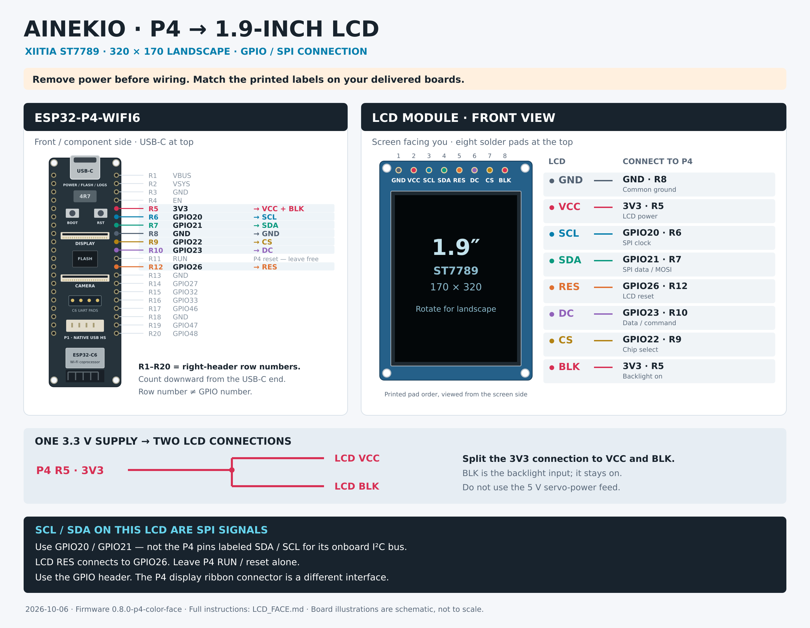

# 1.9-inch LCD and wide face expressions

The P4 source now supports the project's recorded XIITIA 1.9-inch ST7789
module (ASIN B0DFWMC16W), using its 170×320 panel in **320×170 landscape**.
The owner confirmed on October 6 that the LCD and camera are connected and
working, with both images upside down in the installed orientation.
Version `0.8.2-p4-connection-lcd` was installed with flash hash verification.
The owner confirmed the LCD is upright; fresh camera stills are upright too.
Version `0.8.3-p4-face-warnings` removes the connected text footer and adds small
fault icons without covering the face. It was installed on October 6 with
application-only flash hash verification, preserving saved settings/calibration.

The resting face follows the owner's supplied robot concept: two cyan pupils,
curved outer lights, small secondary arcs and a black background. The library
redraws every V1 expression name for the wider color screen, plus the newer
motions. Full-color procedural strokes, hearts, stars, chevrons, rings, crosses,
tears and other marks replace the old monochrome bitmaps. The definitions and
renderer are editable; they impose no restriction on future artwork.

* [Animated gallery — open index.html in a browser](face-preview/index.html)
* [Expression sheet](face-preview/contact-sheet.png)
* [Resting face](face-preview/default.png)

## Connections



[Full-resolution wiring image](LCD_Wiring.png) · [Editable vector diagram](LCD_Wiring.svg)

Remove power while connecting. Use the screen's printed labels; the selected
module's listing photo shows `GND VCC SCL SDA RES DC CS BLK`.
The P4 orientation below matches the existing [pinout guide](PCA9685_WIRING.md):
USB-C at the top, component/camera-connector side facing you. `R` row numbers
count down the right header from USB-C and are guide labels, not GPIO numbers.

| LCD label | P4 signal | P4 guide position |
| --- | --- | --- |
| GND | GND | R8 |
| VCC | 3V3 | R5 |
| SCL | GPIO20 — SPI clock | R6 |
| SDA | GPIO21 — SPI data/MOSI | R7 |
| RES | GPIO26 — LCD reset | R12 |
| DC | GPIO23 — data/command | R10 |
| CS | GPIO22 — chip select | R9 |
| BLK | 3V3 — backlight on | Same 3V3 supply as VCC |

The LCD's **SCL/SDA are SPI signals**, despite their names. They do not connect
to the P4's existing I2C SDA/SCL pins or the PCA9685 servo bus. The P4 RESET/RUN
pin is also separate from the GPIO26 LCD-reset output. This module connects to
the GPIO header, not the board's MIPI display ribbon connector. VCC and BLK use
the 3.3 V logic supply; do not connect them to the servo V+ feed.

The backlight is always powered in this wiring. Doze turns off the LCD image
through its controller; it does not disconnect the backlight supply.

Wiring is based on the project's selected module and the manufacturer's
[listing photograph](https://m.media-amazon.com/images/I/61+SRVQAjTL._AC_SL1500_.jpg),
the [Waveshare schematic](https://files.waveshare.com/wiki/ESP32-P4-WIFI6/ESP32-P4-WIFI6-datasheet.pdf)
and the checked-in P4 pinout. Confirm that the delivered module has these labels
before wiring a different variant. The recorded module is specified as 170×320;
the LCD's 180-degree rotation now defaults on for the owner's installed mounting.

## Operation

The LCD shows connection guidance locally during startup and connection loss,
without needing a gateway or a separate asset-partition installation. Once Wi-Fi
and Body Control are connected, the face returns with no permanent status text.
In Body Control, use the **Faces** section: search or filter its 59 expressions,
then select a card to show that face on the robot. The larger preview animates
the selected expression. Collections separate expressions, speaking variants,
and motion-associated faces; selecting any card sends only `intent face`, even
when its name is `run` or `walk`. No body movement is required or requested.
Previews are rendered from the same `faces.def` and C renderer as the firmware.
The existing **Face or sound asset** field remains available for name entry.
Examples: `default`, `happy`, `love`, `curious`, `angry`, `sleepy`, `wave`, `run`.
The next accepted motion takes over expression selection. Updating an ongoing
walk's speed keeps its current presentation timeline.

The original named-motion cue names and times are compiled from each motion's
existing execution contract. Motions without recorded cues use their own face
name, including Crawl, Crouch, Lay Down and Upright. Named cues follow the
same sampled motion time as the servos, including the operator's playback rate
and existing common speed limit. Entry holds the initial expression until
motion playback begins. Walking expressions follow gait phase, and automatic
Walk/Run transitions select the corresponding face. Finished standing poses
return to the breathing/blinking resting face; looping Rest remains animated.
Speaker playback adds animated voice bars to the selected expression.

### Connection and setup guidance

The display reads the existing network/provisioning and controller state:

| Situation | LCD information |
| --- | --- |
| Startup | Starting Wi-Fi / looking for a connection |
| Searching saved networks | Current network name, connection problem when known, router/hotspot instruction, countdown to setup |
| No saved Wi-Fi or saved networks unavailable | Actual robot setup SSID and its existing Wi-Fi password; then the setup browser address and instructions |
| Wi-Fi connected, Body Control absent | Network name, robot IP, start-Body-Control instruction, automatic retry status |
| Server explicitly rejects pairing | Pairing-token instructions; protocol-version rejection has a separate message |
| Connected, healthy | Only the existing animated face; no status text or icons |
| Connected, servo-controller fault | Small amber warning triangle at bottom left; face animation continues |
| Connected, camera has failed | Small amber camera icon beside the warning triangle position |
| Setup portal or Wi-Fi initialization fails | Failure message and restart/USB recovery instructions, without advertising a working setup page |

Setup instructions alternate every 12 seconds. Join the shown **Ainekio-P4-…**
network from a phone/computer using the displayed password, keep that connection
even if the device says it has no Internet, and open the displayed **http://**
address (normally **http://192.168.4.1/**). Enter the replacement Wi-Fi network
and password; check the Body Control address and pairing token. Saving uses the
existing setup portal and restarts the robot. Rejoin the selected Wi-Fi afterward.
The LCD preserves password case and wraps long ASCII credentials instead of
truncating them. It displays the setup hotspot password, never the saved router
password or robot pairing token. The compact font supports printable ASCII;
non-ASCII SSID characters appear as question marks.

Connection behavior is unchanged: missing configuration starts setup immediately;
saved Wi-Fi is tried for 60 seconds before automatic setup. Existing setup sessions
last 10 minutes, followed by a 60-second retry interval; the LCD shows when setup
will reopen. Saved profiles keep retrying while automatic setup is open.
If Wi-Fi works but the server is unavailable, the LCD gives server recovery
instructions rather than claiming that Wi-Fi has failed. To change networks while
connected, use **Body Control > Settings > Robot Wi-Fi and pairing**. To open
setup manually without a working Body Control session, the existing USB console
command is `net ap`. The P4 BOOT button has no application setup handler.

These are presentation changes only. They do not add motion stops, change
connection timeouts, erase settings, or introduce another connection owner.
The servo warning reads existing I/O, deadline and progress faults; an intentional
Signal Stop or detached output is not an error icon. The camera icon requires a
reported failure with the camera currently unavailable, rather than lighting for
an old dropped frame or deliberately disabled preview. Icons disappear when their
fault clears. The P4 still reports `battery_available=false`: there is no measured
battery voltage to drive a low-battery warning yet. No battery level is inferred
from Wi-Fi, USB or servo behavior.

The console provides:

```text
face             # Driver status, active expression, frames, peak render time
face list        # Every accepted expression name
face love        # Manual expression, no body movement
face auto        # Restore motion-driven expression selection
```

`display_ready` means the configured driver initialized and transfers are
succeeding. This write-only SPI connection cannot detect whether an LCD is
physically connected. An image on the panel is the hardware confirmation.

## Implementation and configuration

`main/display.c` owns the panel and SPI2. It runs at task priority 2, below the
existing body owner, and polls a read-only snapshot of the successful motion
sample. No rendering, pixel transfer, display lock, or display failure enters
the servo task. The implementation does not change joint positions, speed
limits, gait geometry, calibration, or saved robot settings.

The renderer uses RGB565: 108,800 bytes in PSRAM for one complete frame and
10,240 bytes of internal DMA memory for a 16-row transfer stripe. Each stripe
is retained until the SPI completion callback before reuse. Faces are compiled
into the application; V1 face assets and V1 firmware remain unchanged.
`main/connection_screen.c` formats and renders the status pages into the same
framebuffer. Network and controller owners publish read-only status; rendering
never calls Wi-Fi RPCs or opens a connection. Credentials stay in local LCD data.

ESP-IDF's built-in ST7789 panel implementation supplies initialization,
landscape addressing and SPI DMA transport. The selected ESP-IDF 5.5.4 source
supports little-endian RGB565, matching the renderer's pixel buffer.
See [Espressif's SPI LCD documentation](https://docs.espressif.com/projects/esp-idf/en/v5.5/esp32p4/api-reference/peripherals/lcd/spi_lcd.html).

Under `idf.py menuconfig` → **Ainekio wide face LCD**, configure the five GPIOs,
SPI frequency, frame rate, landscape row offset, 180-degree rotation, RGB/BGR
order, and inversion. Initial settings are 40 MHz, 30 fps, row offset 35,
RGB, inversion and 180-degree rotation enabled. These are a selected panel profile, not measured
throughput or visual qualification of the delivered module.

`Slave/software/faces/faces.def` owns the expression recipes.
`Slave/software/faces/face.c` owns the geometry, colors and animation.
`main/face_timeline.c` resolves compiled motion cues. The same C renderer
produces the gallery, so previews do not use separately recreated browser art.
Body Control's generated catalog and previews are in
`Master/gateway/dashboard/static/faces/`. Regenerate after editing the library:

```sh
/usr/bin/cmake --build /tmp/ainekio-lcd-native --target face_preview
python3 Slave/software/faces/tools/gallery.py \
  --renderer /tmp/ainekio-lcd-native/faces/face_preview \
  --out Master/gateway/dashboard/static/faces --dashboard
```

Restart Body Control after adding/removing assets so its static-file catalog
reloads. Firmware changes are needed only when expression definitions change;
the installed face command already handles selection without movement.

## Validation and reproduction

```sh
/usr/bin/cmake -S Slave/firmware/esp32p4-wifi6/tests -B /tmp/ainekio-lcd-native \
  -DCMAKE_BUILD_TYPE=Release -DPython3_EXECUTABLE=/path/to/python-with-numpy
/usr/bin/cmake --build /tmp/ainekio-lcd-native -j4
/usr/bin/ctest --test-dir /tmp/ainekio-lcd-native \
  -R '^(wide_color_faces|motion_face_timeline|body_execution|v2_clips|v2_clip_compiler|v2_gait_timing)$' \
  --output-on-failure
python3 Slave/software/faces/tools/gallery.py \
  --renderer /tmp/ainekio-lcd-native/faces/face_preview \
  --out docs/v2-12servo/face-preview
```

The focused face renderer, motion-face timeline, connection-guidance and camera
tests pass, including the 180-degree pixel mapping across native/downsampled
images and mode switches. The P4 application cross-build passes with ESP-IDF
5.5.4. LCD orientation has owner confirmation. SPI signal quality and concurrent
loaded-device timing still require physical measurements.

The `lcd_connection_guidance` native test checks connection/setup/recovery states,
explicit pairing rejection, portal-failure presentation, full-length credentials,
page rotation, text fit, framebuffer boundaries, an untouched healthy face and
fault-icon placement outside the eyes/voice bars. It can write a contact sheet
using the production renderer with fake example credentials:

```sh
/usr/bin/cmake --build /tmp/ainekio-lcd-native --target test_connection_screen
/tmp/ainekio-lcd-native/test_connection_screen /tmp/ainekio-connection-screens.ppm
```

Use the existing application-only installation procedure when ready. Flashing
reboots the P4 and may run its saved Home. This change requires no partition
table rewrite, NVS erase, or face filesystem image.
